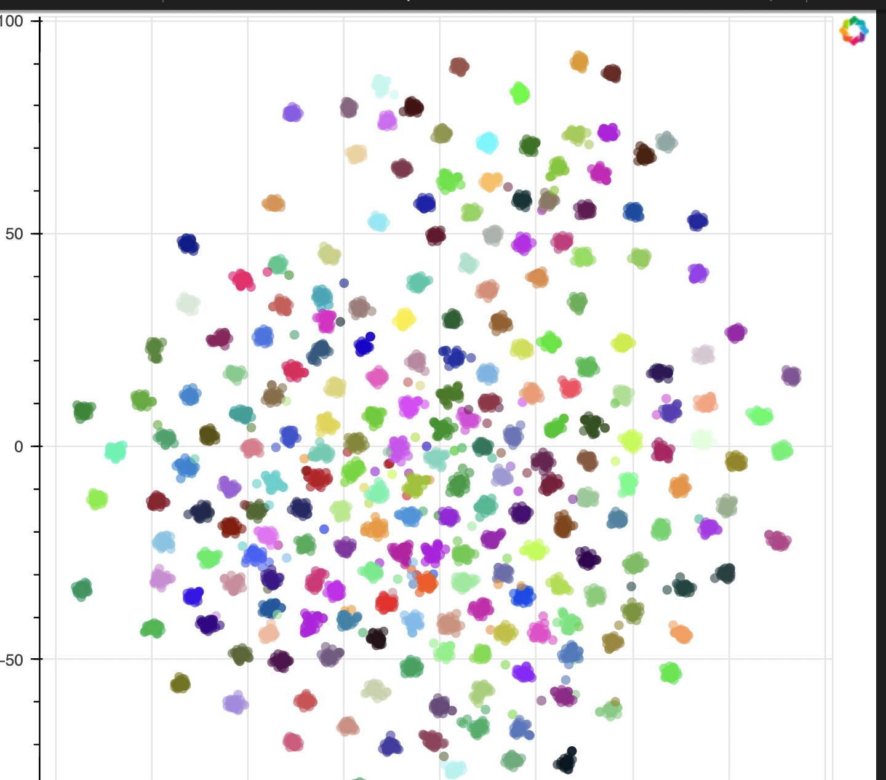

# Testing SOTA open-source Voxceleb speaker models on Aishell-3

## Install requirements
``` bash
pip install -r requirements.txt
```
## Run testing
``` bash
python main.py -f <aishell3-folder> -d cuda -n 32
>>> eer: 0.063

```


## Visualization




## results
ResnetSE aishell3 eer: 0.08402362651209677

SpeechBrain aishell3 eer: 0.05950225239415323
